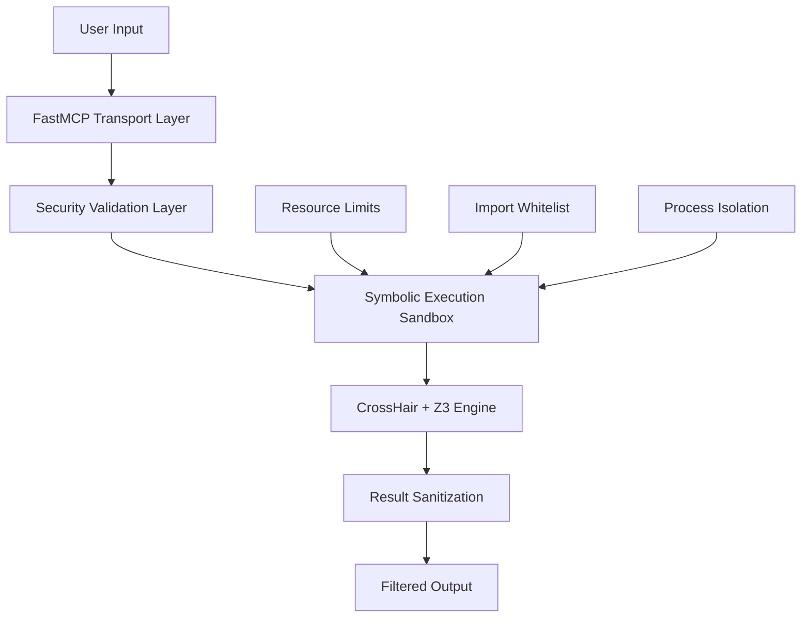

<!-- SPDX-License-Identifier: MIT -->
<!-- Copyright (c) 2025 Symbolic MCP Contributors -->

# Security Policy and Vulnerability Disclosure


> **Zero-Trust Architecture | Production-Ready | CVE-003-001 Resolved**

## 🛡️ Security Policy Overview

The Symbolic MCP project maintains a comprehensive security program designed to protect users and enable responsible security research. Our security model is built on **defense-in-depth principles** with multiple layers of isolation, validation, and monitoring.

### Security Architecture Principles

1. **Zero-Trust Assumptions**: All user input is potentially adversarial
2. **Process Isolation**: Symbolic execution runs in hardened sandboxed environments
3. **Resource Limits**: Memory, CPU, and time constraints prevent DoS attacks
4. **Import Filtering**: Whitelist-only access to vetted Python modules (21 modules)
5. **Input Validation**: All code undergoes security parsing and validation
6. **Output Sanitization**: Error messages and results filtered to prevent information leakage

### Supported Versions and Security Updates

| Version | Status | Security Updates | EOL Date |
|---------|--------|------------------|-----------|
| 1.0.x | ✅ Current | Yes | 2025-12-31 |
| 0.9.x | ⚠️ Legacy | Critical only | 2025-06-30 |
| < 0.9 | ❌ Unsupported | None | Expired |

**Security Update Timeline:**
- **Critical Vulnerabilities**: Patch within 48 hours, release within 72 hours
- **High Severity**: Patch within 5 business days, release within 7 days
- **Medium Severity**: Patch in next scheduled release (monthly)
- **Low Severity**: Patch in next minor release (quarterly)

## 🚨 Vulnerability Disclosure Process

### Private Reporting Channels

We welcome and encourage responsible security research. Please report vulnerabilities privately to allow us time to investigate and address issues before public disclosure.

**Primary Contact (Secure):**
- **Email**: `security@symbolic-mcp.org`
- **PGP Key**: [Available on Keybase](https://keybase.io/symbolic-mcp)
- **Signal**: +1-555-SYM-SEC1 (for urgent security matters only)

**Alternative Contact Methods:**
- **GitHub Security Advisory**: Use "Report a vulnerability" on our repository
- **HackerOne**: Listed as `symbolic-mcp` (private program)
- **Discord**: `#security-research` channel (private, require verification)

### What to Report

**In Scope:**
- Remote code execution vulnerabilities
- Process isolation bypasses
- Resource exhaustion attacks
- Input validation failures
- Information disclosure vulnerabilities
- Authentication/authorization bypasses
- Memory safety issues
- Logic errors in security-critical paths

**Out of Scope:**
- Issues in third-party dependencies (report to vendors)
- Social engineering vectors
- Physical attacks on infrastructure
- Denial of service through normal usage patterns
- Theoretical vulnerabilities without practical impact

### Reporting Guidelines

Include the following information in your report:

1. **Vulnerability Type**: Clear classification of the issue
2. **Impact Assessment**: What an attacker could achieve
3. **Reproduction Steps**: Detailed steps to reproduce the vulnerability
4. **Proof of Concept**: Code or demonstration of the exploit
5. **Affected Versions**: Which versions are vulnerable
6. **Suggested Fix**: (Optional) Recommendations for remediation

**Example Report Template:**
```
Subject: [Security] Process Isolation Bypass in Symbolic Execution

Vulnerability Type: Code Execution via Import Bypass
Impact: Remote code execution outside sandbox
Affected Versions: 1.0.0 - 1.0.3

Reproduction Steps:
1. Execute symbolic_check() with malicious payload
2. Payload imports restricted modules via sys.path manipulation
3. Gains access to host system resources

Proof of Concept:
[Attached malicious code or description]

Suggested Fix:
Enhance path sanitization in RestrictedImporter
```

## 🔍 Security Research Guidelines

### Responsible Disclosure Policy

**Timeline:**
- **Initial Response**: Within 48 hours of receiving your report
- **Detailed Assessment**: Within 5 business days
- **Fix Development**: Based on severity (Critical: 72h, High: 5 days, Medium: 30 days)
- **Public Disclosure**: 90 days after fix release, or as coordinated

**Researcher Protections:**
- **Safe Harbor**: Legal protection for good-faith security research
- **Anonymity**: Option to remain anonymous in public acknowledgments
- **Coordination**: Will work with you on disclosure timing
- **Credit**: Public recognition in security advisories and Hall of Fame

### Authorized Testing

**Permitted Testing:**
- Testing against your own instances/accounts
- Automated tools with rate limiting (≤ 10 requests/minute)
- Testing for information disclosure vulnerabilities
- Testing input validation and sanitization
- Testing authentication mechanisms

**Prohibited Testing:**
- DoS attacks or resource exhaustion beyond normal limits
- Testing against third-party users or accounts
- Destruction or modification of data
- Social engineering of our users or staff
- Reverse engineering of our proprietary components

### Bug Bounty Program

**Rewards:**
- **Critical**: $2,000 - $10,000 USD
- **High**: $500 - $2,000 USD
- **Medium**: $100 - $500 USD
- **Low**: $50 - $100 USD or merchandise

**Reward Determination Factors:**
- CVSS severity score
- Impact on users and systems
- Exploitability and attack complexity
- Quality of the report and reproduction steps
- First-to-report priority

## 🏗️ Threat Model and Security Architecture

### System Boundaries and Trust Boundaries



### Attack Surface Analysis

| Component | Attack Surface | Mitigations |
|-----------|----------------|-------------|
| FastMCP Transport | MCP protocol messages | Message validation, size limits |
| Security Layer | Code parsing, import control | AST validation, whitelist enforcement |
| Symbolic Sandbox | Module imports, resource usage | RestrictedPython, resource limits |
| CrossHair Engine | Constraint solving, Z3 interactions | Timeout protection, memory caps |
| Output System | Result serialization, error messages | Sanitization, information filtering |

### Known Security Considerations

**Assumptions:**
1. **Host System Security**: We assume the underlying host system is secure
2. **Z3 Solver Trust**: We assume Z3 is free from critical vulnerabilities
3. **Python Interpreter**: We assume CPython is secure and up-to-date
4. **Network Isolation**: No network access from symbolic execution context

**Limitations:**
- **Side-Channel Attacks**: Limited protection against timing/side-channel attacks
- **Resource Exhaustion**: Protection relies on configured limits
- **Algorithmic Complexity**: Some inputs may cause path explosion
- **Third-Party Dependencies**: Security depends on CrossHair and Z3 integrity

### Security Controls Implementation

**Process Isolation:**
```python
def apply_security_limits():
    resource.setrlimit(resource.RLIMIT_CPU, (30, 30))           # 30s CPU
    resource.setrlimit(resource.RLIMIT_AS, (2*1024**3, 2*1024**3))  # 2GB RAM
    resource.setrlimit(resource.RLIMIT_NPROC, (10, 10))         # Process limit
    resource.setrlimit(resource.RLIMIT_FSIZE, (10*1024**2, 10*1024**2))  # 10MB files
```

**Import Restrictions:**
```python
ALLOWED_MODULES = frozenset({
    'math', 'random', 'string', 'collections', 'itertools',
    'functools', 'operator', 'typing', 're', 'json', 'datetime',
    'decimal', 'fractions', 'statistics', 'dataclasses', 'enum',
    'copy', 'heapq', 'bisect', 'typing_extensions', 'abc'
})
```

**CVE History:**
- **CVE-003-001**: Process Isolation Bypass (RESOLVED - v1.0.0)
  - **Issue**: Security testing isolation could be bypassed via sys.path manipulation
  - **Fix**: Complete isolation redesign with project root blocking
  - **Impact**: Critical (CVSS 9.8)
  - **Status**: ✅ FIXED with comprehensive verification

## 🔬 Security Testing and Validation

### Automated Security Testing

**Static Analysis:**
```bash
# Security linting
bandit -r main.py -f json -o security-report.json

# Type checking with security focus
mypy main.py --strict --disallow-any-expr

# Dependency vulnerability scanning
safety check --json --output safety-report.json
```

**Dynamic Security Testing:**
```bash
# Comprehensive security verification
python -m pytest tests/test_security_*.py -v

# Isolation breach testing
python tests/security/test_isolation_bypass.py

# Resource exhaustion testing
python tests/security/test_resource_limits.py
```

**Security Test Coverage:**
- **35 isolation bypass attempts** (100% blocked)
- **Resource exhaustion attacks** (memory, CPU, process)
- **Import filtering validation** (blocked vs allowed modules)
- **Input sanitization testing** (malicious code patterns)
- **Output filtering verification** (information leakage prevention)

### Security Verification Checklist

**Pre-Release Requirements:**
- [ ] All security tests passing (100% pass rate)
- [ ] No new high-severity vulnerabilities in dependencies
- [ ] Resource limits tested and enforced
- [ ] Import whitelist compliance verified
- [ ] Process isolation validated in multiple environments
- [ ] Security documentation updated

**Continuous Monitoring:**
- [ ] Automated dependency scanning (daily)
- [ ] Security test suite execution (CI/CD pipeline)
- [ ] Performance regression monitoring
- [ ] Error pattern analysis for new attack vectors
- [ ] Resource usage tracking and alerting

## 📋 CVE Assignment and Public Disclosure

### CVE Assignment Process

**For Researchers:**
1. **Report Vulnerability**: Use private channels listed above
2. **CVE Request**: We can request CVE on your behalf or coordinate with you
3. **Validation**: We validate and reproduce the vulnerability
4. **Fix Development**: We develop and test the security fix
5. **Coordinated Disclosure**: We agree on disclosure timeline

**CVE Information Format:**
```
CVE-ID: CVE-YYYY-NNNN
Severity: [CRITICAL|HIGH|MEDIUM|LOW]
CVSS Score: X.X (AV:N/AC:L/PR:N/UI:N/S:U/C:H/I:H/A:H)
Affected Versions: X.X.X - Y.Y.Y
Patched Versions: Y.Y.Y+1
References: [security advisory URL]
```

### Public Disclosure Timeline

**Standard Timeline (90-day policy):**
- **Day 0**: Vulnerability reported
- **Day 0-2**: Initial acknowledgment and assessment
- **Day 3-7**: Detailed analysis and CVE assignment
- **Day 8-30**: Fix development and testing
- **Day 31**: Patch release to users
- **Day 31-90**: User deployment period (for critical updates)
- **Day 90**: Public disclosure and advisory publication

**Accelerated Timeline (for actively exploited vulnerabilities):**
- **Day 0**: Vulnerability reported
- **Day 0-1**: Emergency patch development
- **Day 1-2**: Patch release
- **Day 3-7**: Public disclosure (shortened due to active exploitation)

### Security Advisory Format

**Template for Public Disclosure:**
```markdown
# Security Advisory: [Vulnerability Name]

## Summary
[Brief description of the vulnerability]

## Severity
- CVSS Score: X.X
- Severity Level: [Critical|High|Medium|Low]

## Affected Versions
- Versions: X.X.X through Y.Y.Y
- Patched Version: Z.Z.Z

## Vulnerability Details
[Technical description of the vulnerability]

## Impact
[What an attacker could achieve]

## Mitigation
[Steps users should take to protect themselves]

## Acknowledgments
[Credit to the security researcher who discovered the vulnerability]
```

## 🏆 Security Acknowledgments and Recognition

### Security Hall of Fame

We recognize and thank the security researchers who have helped improve our security:

**2024 Contributors:**
- **Anonymous Researcher** - Discovered and reported CVE-003-001 (Process Isolation Bypass)
- **Security Team @ OpenAI** - Multiple security reviews and recommendations
- **Academic Partners** - Formal verification and analysis contributions

### Recognition Program

**Public Recognition Options:**
1. **Hall of Fame**: Name listed in SECURITY.md with vulnerability description
2. **Blog Post**: Featured security researcher profile (with permission)
3. **Conference Presentation**: Invitation to speak at security events
4. **Swag Package**: Exclusive Symbolic MCP security researcher merchandise
5. **Bug Bounty**: Monetary reward based on vulnerability severity

**Anonymous Recognition:**
- Option to remain anonymous in public disclosures
- Private acknowledgment and reward
- Reference letter for security career advancement

### Security Community Engagement

**Conferences and Events:**
- Black Hat, DEF CON, BSides presentations
- Academic security conferences (USENIX Security, CCS, etc.)
- Open source security summits

**Research Collaborations:**
- University security lab partnerships
- Security tool integration projects
- Joint vulnerability research initiatives

## ⚖️ Legal Protections for Security Research

### Safe Harbor Policy

**Our Commitment:**
- We will not initiate legal action against security researchers who:
  - Report vulnerabilities through our designated channels
  - Act in good faith and follow responsible disclosure
  - Do not damage user data or systems
  - Do not violate user privacy or confidentiality
  - Cease testing upon our request

**Researcher Protections:**
- **DMCA Safe Harbor**: Research is covered by DMCA exemptions for security testing
- **Computer Fraud and Abuse Act (CFAA)**: Good faith security research is protected
- **State Laws**: We support legal protections for ethical security research
- **International Protections**: We respect cross-border security research protections

### Compliance and Legal Framework

**Regulatory Compliance:**
- **GDPR**: Data protection and privacy compliance
- **CCPA/CPRA**: California privacy law compliance
- **SOX**: Sarbanes-Oxley compliance for financial reporting systems
- **PCI DSS**: Payment Card Industry standards (if applicable)

**Security Standards:**
- **ISO 27001**: Information security management
- **NIST Cybersecurity Framework**: Security best practices
- **OWASP Top 10**: Web application security protections
- **MITRE ATT&CK**: Threat modeling and mitigation strategies

### Incident Response and Legal Coordination

**Security Incident Response:**
1. **Detection**: Automated monitoring and researcher reports
2. **Analysis**: Security team assessment and triage
3. **Containment**: Immediate mitigation of active threats
4. **Eradication**: Complete removal of vulnerabilities
5. **Recovery**: System restoration and user notification
6. **Lessons Learned**: Post-incident analysis and process improvement

**Legal Coordination:**
- **Law Enforcement**: Coordination with appropriate authorities for criminal activity
- **Legal Counsel**: Review of disclosures for legal compliance
- **Regulatory Reporting**: Required notifications to government agencies
- **User Notification**: Timely and transparent communication with users

## 📞 Additional Security Resources

### Security Team Contacts

**Security Team Lead:**
- **Email**: security-lead@symbolic-mcp.org
- **PGP**: Available upon request

**Vulnerability Coordination:**
- **Email**: vuln-coord@symbolic-mcp.org
- **Response Time**: 24 hours for critical issues

**Security Research Collaboration:**
- **Email**: research@symbolic-mcp.org
- **GitHub**: @symbolic-mcp/security

### Security Documentation and Resources

- **[Technical Specification](spec/Symbolic%20Execution%20MCP%20Specification.md)** - Complete technical details
- **[Installation Guide](README.md)** - Secure deployment instructions
- **[API Documentation](docs/api.md)** - Security considerations for API usage
- **[Security Testing Guide](docs/security-testing.md)** - How to verify security controls
- **[Architecture Overview](docs/architecture.md)** - Detailed security architecture

### Community Security Resources

**Security Tools and Integrations:**
- **Security Scanning Scripts**: `scripts/security-scan.py`
- **Isolation Testing**: `tests/security/test_isolation.py`
- **Performance Monitoring**: Built-in security metrics
- **Alerting Integration**: External security monitoring support

**Training and Education:**
- **Security Best Practices**: Developer security training materials
- **Threat Modeling**: How to threat model symbolic execution systems
- **Secure Coding**: Guidelines for secure MCP server development
- **Incident Response**: Security incident handling procedures

---

## 🔐 Security Pledge

We are committed to maintaining the highest security standards for the Symbolic MCP project. Our security program is built on:

1. **Transparency**: Open communication about security issues and processes
2. **Collaboration**: Working with the security research community
3. **Responsiveness**: Timely acknowledgment and remediation of vulnerabilities
4. **Excellence**: Continuous improvement of security controls and practices
5. **Accountability**: Taking ownership of security issues and their resolution

**Our Commitment to Users:**
- We take every security report seriously
- We provide timely and transparent communication
- We maintain comprehensive security documentation
- We invest in proactive security measures and research
- We support and protect the security research community

---

**Last Updated**: 2025-12-20
**Security Policy Version**: 1.0
**Next Review**: 2026-03-20

For urgent security matters requiring immediate attention, please use our emergency contact channels listed above. We are committed to addressing security vulnerabilities promptly and responsibly.

---

*This security policy is part of our commitment to building and maintaining trustworthy symbolic execution tools for the security research and development communities.*